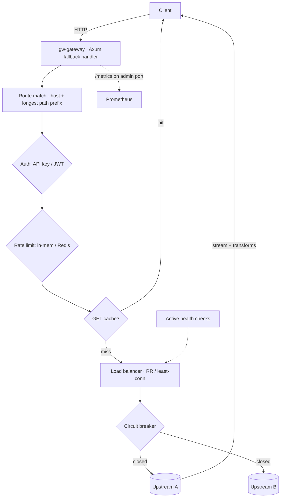

# rust-api-gateway

An asynchronous **reverse proxy and API gateway** in Rust (Tokio, Hyper, Axum, Tower). It does host/path routing, load balancing (round-robin & least-connections), resilience (active health checks, passive failure detection, circuit breaking, retries, timeouts), authentication (API key & JWT), rate limiting (in-memory & Redis-backed), response caching, header transforms, correlation IDs, and full Prometheus observability — all driven by validated YAML config.

> **Status:** functional and tested. 25 unit tests + 12 integration tests (37 total) pass, exercising the real proxy against mock upstreams — routing, retries, a circuit breaker actually opening, rate limiting, caching, timeouts and auth. Benchmarks ship as a reproducible script with **no invented numbers**.

---

## Table of contents
- [Why this exists](#why-this-exists)
- [Features](#features)
- [Architecture](#architecture)
- [Technology decisions](#technology-decisions)
- [Configuration](#configuration)
- [Local setup](#local-setup)
- [Docker setup](#docker-setup)
- [Environment variables](#environment-variables)
- [Examples](#examples)
- [Testing](#testing)
- [Benchmarks](#benchmarks)
- [Observability](#observability)
- [Failure handling](#failure-handling)
- [Security considerations](#security-considerations)
- [Known limitations](#known-limitations)
- [Roadmap](#roadmap)

## Why this exists

**Business problem.** Microservice fleets need a single front door: one place to route by host/path, balance load, authenticate, rate-limit, cache, and observe traffic — so individual services don't each reinvent it.

**Technical problem.** A gateway sits on the hot path of *every* request, so it must be fast, resilient and safe: never amplify an upstream outage, shed load gracefully, time out hung calls, and emit the metrics you need to operate. This implements those behaviors on Tokio with a config-driven routing table.

## Features

1. **Routing** — host-based and path-prefix routing, longest-prefix wins, configurable upstreams, per-route settings, validated config.
2. **Reverse proxy** — forwards method/headers/query/body, injects `X-Forwarded-*`, strips hop-by-hop headers, streams responses, enforces a body-size limit and upstream timeouts.
3. **Load balancing** — round-robin (weighted) and least-connections, with live active-request tracking.
4. **Resilience** — active health checks, passive failure detection, a per-upstream **circuit breaker**, retries for eligible requests, connection/request timeouts, graceful shutdown.
5. **Authentication** — API keys and HS256 **JWT** validation, per-route policy.
6. **Rate limiting** — per-IP, per-API-key and per-route scopes; **in-memory** and **Redis-backed** (distributed) implementations; standard `X-RateLimit-*` / `Retry-After` headers.
7. **Transformations** — add/remove request and response headers; correlation IDs (`X-Request-ID`).
8. **Caching** — TTL cache for eligible GET responses, capacity-bounded, with `Cache-Control` bypass and `X-Cache: HIT/MISS` plus hit/miss metrics.
9. **Observability** — request/status counters, upstream & gateway latency histograms, active-connection gauge, rate-limit & auth rejection counters, circuit-breaker state gauge, cache hit/miss counters, structured access logs and correlation IDs.

## Architecture



**Crates**

| Crate | Responsibility |
|-------|----------------|
| `gw-core` | Config model (YAML, validated) and pure host/path route matching. |
| `gw-telemetry` | Tracing + Prometheus collectors. |
| `gw-gateway` | Runtime: balancer, circuit breaker, cache, rate limiters, auth, header transforms, the proxy handler, health checks, and the server. |
| `gw-integration-tests` | End-to-end tests with in-process mock upstreams. |

## Technology decisions

- **Axum fallback handler over a typed config table** — a single handler proxies all methods/paths; routing is data, not code. Simple to reason about and to reload.
- **`reqwest` as the upstream client** — battle-tested connection pooling, rustls, per-request timeouts and response streaming. Request bodies are buffered up to the configured limit; response bodies are **streamed** (documented trade-off).
- **Epoch-free, per-request timeouts** via the client; **circuit breaker** as the cross-request resilience primitive.
- **`RateLimiter` trait** with in-memory and Redis impls, selected by config — distributed limiting without coupling the proxy to Redis.
- More in [docs/design-decisions.md](docs/design-decisions.md).

## Configuration

YAML, validated at startup (see [config/gateway.yaml](config/gateway.yaml)). A minimal example:

```yaml
server:
  bind_addr: "0.0.0.0:8080"
  admin_bind_addr: "0.0.0.0:9090"
  # redis_url: "redis://localhost:6379"   # enables distributed rate limiting
routes:
  - name: api
    matches: { path_prefix: "/api" }
    strip_path_prefix: true
    strategy: round_robin
    retries: 2
    upstreams:
      - { url: "http://127.0.0.1:9001", weight: 1 }
      - { url: "http://127.0.0.1:9002", weight: 1 }
    circuit_breaker: { failure_threshold: 5, open_secs: 10 }
    health_check: { path: "/", interval_secs: 5 }
    cache: { ttl_secs: 10 }
    rate_limit: { scope: ip, limit: 100, window_secs: 60 }
    auth: { type: jwt, secret: "change-me", required_claims: { role: "user" } }
    request_headers: { add: { x-gateway: "rust-api-gateway" } }
    response_headers: { remove: ["server"] }
```

Environment-variable override: the config **path** is set by `GATEWAY_CONFIG` (or argv[1]). Hot reload is **not** implemented — it is a [roadmap](ROADMAP.md) item; today, restart to apply changes.

## Local setup

```bash
# Run the gateway with the example config
cargo run -p gw-gateway -- config/gateway.yaml
# Proxy on :8080, admin (health/metrics) on :9090

make ci   # fmt-check + clippy + test
```

(The example config points at `echo1`/`echo2` — use the Docker stack below for working upstreams, or edit the URLs.)

## Docker setup

```bash
docker compose up --build
# gateway :8080 (proxy) / :9090 (admin), two echo upstreams, Redis, Prometheus :9091
curl localhost:8080/echo/anything        # round-robin echo
curl localhost:9090/metrics
```

## Environment variables

See [.env.example](.env.example). The gateway is config-file driven; env covers `GATEWAY_CONFIG`, `RUST_LOG`, `LOG_JSON`.

## Examples

```bash
# Path routing + prefix strip: /api/users → upstream /users
curl localhost:8080/api/users/1

# Rate limiting returns 429 with headers once the window is exhausted
curl -i localhost:8080/api/...        # X-RateLimit-Limit / -Remaining / -Reset

# Correlation id is echoed back (generated if absent)
curl -i localhost:8080/echo/ | grep -i x-request-id

# Cache: second identical GET returns X-Cache: HIT
curl -i localhost:8080/echo/cacheable | grep -i x-cache
```

## Testing

```bash
cargo test --workspace --all-features
```

Unit tests cover route matching, the circuit-breaker state machine, the load balancer (RR/weighted/least-conn/health-skip), the TTL cache, rate limiters and auth (API key + JWT). Integration tests spin up **real** mock upstreams and the **real** proxy and assert: path routing + prefix strip, host routing, header forwarding (`X-Forwarded-For`), round-robin distribution, retry past a dead upstream, **circuit breaker opening**, rate limiting (429), API-key auth (401/200), upstream timeout (502), oversized-body rejection (413), GET caching (`X-Cache`), and metrics recording. No external services required.

## Benchmarks

A reproducible comparison script is provided at [`scripts/bench.sh`](scripts/bench.sh):

```bash
GATEWAY=http://localhost:8080/echo/ UPSTREAM=http://localhost:8081/ \
REQUESTS=20000 CONCURRENCY=50 ./scripts/bench.sh
```

It runs the same load against the upstream **directly** and **through the gateway** using `oha` (or `wrk`), so you can read the gateway's overhead and observe CPU/memory (`docker stats`) on your hardware. It reports RPS and P50/P95/P99 from the tool. **No benchmark numbers are committed** — results depend entirely on hardware and upstream cost; publishing canned figures would be misleading.

## Observability

Admin port (`:9090`): `GET /healthz`, `GET /readyz`, `GET /metrics`. Metrics include `gw_requests_total{route,method,status}`, `gw_upstream_latency_seconds`, `gw_gateway_latency_seconds`, `gw_active_connections`, `gw_rate_limit_rejections_total`, `gw_auth_rejections_total`, `gw_upstream_errors_total`, `gw_cache_hits_total`/`gw_cache_misses_total`, and `gw_circuit_breaker_state{route,upstream}`. Structured `tracing` logs (`LOG_JSON=true` for JSON) with correlation IDs.

## Failure handling

- **Upstream down / connection error:** retried (idempotent methods or connect errors) over other upstreams; breaker records the failure; otherwise `502`.
- **Upstream 5xx:** counts against the circuit breaker (passive detection); retried if eligible.
- **Breaker open:** requests to that upstream are rejected fast; if no upstream is eligible → `503`.
- **Upstream timeout:** the request times out → `502`.
- **Oversized body:** rejected with `413`.
- **Graceful shutdown:** SIGINT/SIGTERM drains in-flight requests and stops health checks.

## Security considerations

API-key and JWT auth are per-route; secrets live in config (keep it out of Git / inject via secret management). Hop-by-hop headers are stripped; a body-size limit is enforced. The gateway terminates plain HTTP — front it with TLS termination (or see TLS on the roadmap). See [SECURITY.md](SECURITY.md).

## Known limitations

- **WebSocket proxying** is not implemented (HTTP only) — [roadmap](ROADMAP.md).
- **Config hot reload** is not implemented; restart to apply changes — [roadmap](ROADMAP.md).
- Request bodies are buffered (bounded) before forwarding; responses stream.
- TLS termination is expected to be handled upstream (e.g. by an LB) for now.
- Rate-limit windows are fixed (not sliding); the in-memory limiter is per-instance (use Redis for multi-instance).

## Roadmap

See [ROADMAP.md](ROADMAP.md): WebSocket proxying, config hot reload, native TLS (Rustls) termination, sliding-window limiting, and OpenTelemetry traces.

## License

MIT — see [LICENSE](LICENSE).
